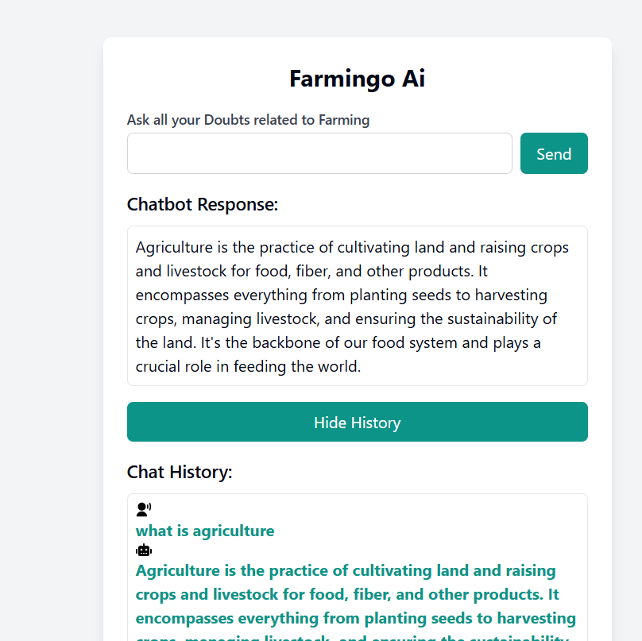

# AI Chatbot Project

This is an AI chatbot built using Node.js and Express. It serves as a conversational interface capable of understanding and responding to user queries. The bot is built using the Gemini framework (or your AI model of choice) for natural language processing and understanding.

## Table of Contents

- [Installation](#installation)
- [Usage](#usage)
- [Project Structure](#project-structure)
- [Environment Variables](#environment-variables)
- [Endpoints](#endpoints)
- [Contributing](#contributing)
- [License](#license)

## Installation

1. Clone this repository:

   ```bash
   
   cd ai-chatbot
   ```

2. Install the necessary dependencies:

   ```bash
   npm install
   ```

3. Set up the environment variables (refer to [Environment Variables](#environment-variables)) by creating a `.env` file:

   ```bash
   touch .env
   ```

   Add your environment variables in `.env` (example below).

## Usage

1. Run the project in development mode:

   ```bash
   npm run dev
   ```

2. Access the chatbot API locally:

   ```
   http://localhost:3000
   ```

3. You can interact with the chatbot via the provided API endpoints.

## Project Structure

```
.
├── node_modules/          # Project dependencies
├── public/                # Static assets (if any)
├── src/         
│   ├── app.js             # Main Express app configuration
│   └── server.js          # Server configuration
├── .env                   # Environment variables (not committed)
├── .gitignore             # Git ignore file
├── package.json           # Project metadata and dependencies
└── README.md              # Project documentation
```

## Environment Variables

You can define the following environment variables in your `.env` file:

```
# Server Settings
PORT=3000

# AI Model or API Settings
AI_API_KEY=your_ai_api_key

# Other configurations
```

## Endpoints

### `POST /chat`

This endpoint allows you to send user queries to the chatbot and receive responses.

#### Request

```json
{
  "userMessage": "Hello!"
}
```

#### Response

```json
{
  "response": "Hi! How can I assist you today?"
}
```

## Contributing

Feel free to submit pull requests or create issues to improve the project.

1. Fork the repository.
2. Create a new feature branch (`git checkout -b feature-branch`).
3. Commit your changes (`git commit -am 'Add new feature'`).
4. Push to the branch (`git push origin feature-branch`).
5. Create a new Pull Request.

## License

This project is licensed under the MIT License - see the [LICENSE](LICENSE) file for details.


